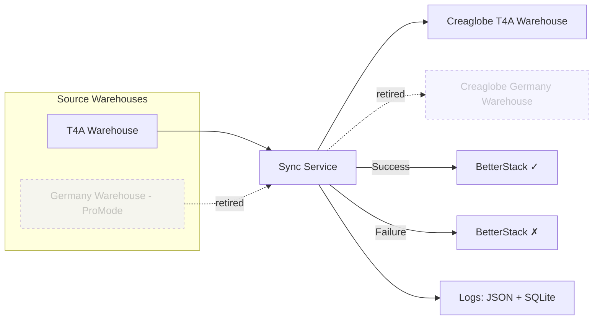

# 🚀 Patrik Metakocka Automation

Automation services for **Metakocka**, built to streamline warehouse operations and eliminate manual work.

---

## 📦 Warehouse Sync

[](https://uptime.betterstack.com/?utm_source=status_badge)

The **Warehouse Sync** service transfers stock levels from the **Time 4 Action** warehouse to the **Creaglobe Metakocka warehouse**, keeping the data up to date and accurate.

> ⚠️ **ProMode / Germany source is retired (July 2026).** Warehouse sync used to also pull
> the Germany warehouse from ProMode's CSV, but T4A no longer uses that warehouse, so it is
> now **T4A-only**. The code is kept (disabled), not deleted — see
> [`docs/deprecated_promode_warehouse_sync.md`](docs/deprecated_promode_warehouse_sync.md).

There is also a **Product Sync**, a **Customer Sync** and a **Pricelist Sync** (all one-way:
T4A → CREAGLOBE) — see [Product Sync](#-product-sync), [Customer Sync](#-customer-sync) and
[Pricelist Sync](#-pricelist-sync) below.

---

## ✨ Features

* 🔄 One-way sync (source → target warehouse)
* ⏰ Scheduled execution via cron (configurable)
* ▶️ Manual **Run Now** option (via API or web UI)
* 📂 Sync results archived as JSON files (local folder)
* ❤️ BetterStack heartbeats:

  * Success → **base URL**
  * Failure → **base URL + `/fail`**
* 🌐 Web dashboard for managing schedules and viewing logs

---

## ⚙️ How It Works



1. Fetch the stock list from **T4A** (Metakocka). *(The ProMode/Germany feed is retired — see note above.)*
2. Transform data into **Creaglobe-compatible** format.
3. Push stock updates into **Creaglobe Metakocka**.
4. Report results to **BetterStack**:

   * ✅ Success → base URL
   * ❌ Failure → base URL + `/fail`
5. Store sync results in **JSON files + SQLite logs**.

---

## 🌐 Web Dashboard

The **scheduler dashboard** (`index.html` served from `/public`) lets you:

* Select **minutes, hours, and days** → generates a valid cron expression
* Enter API key to **update schedule**
* Run sync immediately with **Run Now**
* View the **last 10 runs** (timestamps + stock JSON links)

📸 Example:


---

## 🧬 Product Sync

The **Product Sync** service mirrors the product catalogue **one way**: **T4A → CREAGLOBE**.

* T4A is the single **source of truth** and is **never written to**.
* CREAGLOBE is the **mirror**: products missing there are created, and differing fields are
  overwritten with T4A's values.
* `sales`, `service`, `purchasing` and the product `code`/`count_code` are intentionally
  **not** overwritten on existing CREAGLOBE products.

> Earlier versions attempted a two-way merge. It is now strictly one-directional — see
> `src/services/productSyncService.js` (`generateSmartMerge`, where `changesA`/`newInA` are
> always empty by design).

---

## 👥 Customer Sync

The **Customer Sync** service mirrors customers (Metakocka **partners**) **one way**:
**T4A → CREAGLOBE**. T4A is the source of truth and is never written to; CREAGLOBE customers
are updated to match and missing ones are created.

> ⚠️ **Partners share no key across the two companies.** Unlike products (which share a
> `code`), the partner `count_code` and `mk_id` are per-company internal values — measured
> **0** overlap. Customers are therefore matched by **tax number** first and by **exact name**
> as a fallback.

* Contacts and delivery addresses are synced too, matched by **content** (billing address is
  updated in place; other addresses/contacts are added only when missing) so repeat runs don't
  duplicate them.
* Because a bad match could create a duplicate customer, the sync supports a **dry run**
  (`POST /api/v1/customers/sync?dryRun=true`, or the **Preview** button in the UI) that computes
  the create/update plan **without writing anything** to CREAGLOBE.

See `src/services/customerSyncService.js` and [`docs/customer_sync.md`](docs/customer_sync.md).

---

## 🏷️ Pricelist Sync

The **Pricelist Sync** service mirrors **product prices** **one way**: **T4A → CREAGLOBE**.
T4A is the source of truth and is never written to.

> ⚠️ **A price list's `count_code` does NOT identify the same list across companies.**
> Live data: T4A `7` is **PP GOLD 2026** while CREAGLOBE `7` is **PP BRONZE 2026**. Nine codes
> overlap and every pairing is wrong. This sync therefore **only writes pairs a human has
> explicitly mapped** — nothing is ever guessed.

* Metakocka has **no endpoint that lists price lists**. They are discovered by scanning
  `product_list` with `return_pricelist` and de-duplicating, so a list carrying no products is
  invisible (a mapping to an unseen target is refused unless it opts in).
* A list's identity is `(sales_purchase, count_code)` — sales and purchase lists are numbered
  separately, so T4A `1` is both "RRP 2025" (sales) and "Partner price 2026" (purchase).
* Products are matched by `code` (measured overlap: **1555/1555**).
* Per pair: missing prices are **added**, differing ones **updated**, CREAGLOBE-only rows are
  **left alone** and counted. Fields only CREAGLOBE has survive untouched.
* Each mapping can carry a **max change %** — any single price moving further is refused and
  reported. Live data had CREAGLOBE's "RRP 2025" holding gross where T4A holds net (×1.22), so
  this rail is not theoretical.
* **VAT is mirrored 1:1 from T4A.** Metakocka refuses any price line without a `tax` code —
  its error claims the value is invalid, but it fires when the field is *missing*. T4A leaves
  VAT blank on `RRP 2026` and every `PP 2026` list, so a blank one is written as `000` (0%,
  price with VAT = price), which is what blank means. CREAGLOBE's own tax never wins: a stale
  22% there is corrected down. Blank and `000` compare as equal, so this causes no churn.
* ⚠️ Tax codes `N20`/`N22`/`N85`/`N95` are accepted by Metakocka and then **the row vanishes
  from the price list** — never sent.
* Supports a **dry run** (`POST /api/v1/pricelists/sync?dryRun=true`, or **Preview** in the UI)
  that resolves the entire plan **without writing anything**.

Mappings are edited in the admin portal (Automation → Pricelists) and stored in the
`pricelist_map` table. See `src/services/pricelistSyncService.js` and
[`docs/pricelist_sync.md`](docs/pricelist_sync.md).

---

## 🔑 API Endpoints

| Method | Endpoint                           | Description                            | Auth |
| ------ | ---------------------------------- | -------------------------------------- | ---- |
| `GET`  | `/api/v1/uptime`                   | Health check                           | ❌    |
| `GET`  | `/api/v1/status`                   | Combined status (all syncs)            | ✅    |
| `GET`  | `/api/v1/runs`                     | Run history (`?type=warehouse\|products\|customers`) | ✅ |
| `POST` | `/api/v1/warehouse/sync`           | Run warehouse sync now (async, 202)    | ✅    |
| `GET`  | `/api/v1/warehouse/sync/logs`      | Fetch latest warehouse sync logs       | ❌    |
| `PUT`  | `/api/v1/schedules/warehouse-sync` | Update warehouse cron expression       | ✅    |
| `GET`  | `/api/v1/schedules/warehouse-sync` | Fetch warehouse cron expression        | ❌    |
| `POST` | `/api/v1/products/sync`            | Run product sync now (async, 202)      | ✅    |
| `GET`  | `/api/v1/products/sync/logs`       | Fetch latest product sync logs         | ❌    |
| `PUT`  | `/api/v1/schedules/product-sync`   | Update product cron expression         | ✅    |
| `GET`  | `/api/v1/schedules/product-sync`   | Fetch product cron expression          | ❌    |
| `POST` | `/api/v1/customers/sync`           | Run customer sync now (`?dryRun=true` to preview; async, 202) | ✅ |
| `GET`  | `/api/v1/customers/sync/logs`      | Fetch latest customer sync logs        | ❌    |
| `PUT`  | `/api/v1/schedules/customer-sync`  | Update customer cron expression        | ✅    |
| `GET`  | `/api/v1/schedules/customer-sync`  | Fetch customer cron expression         | ❌    |
| `GET`  | `/api/v1/pricelists`               | Price lists in both companies + mapping suggestions | ✅ |
| `GET`  | `/api/v1/pricelists/mappings`      | Saved source→target price-list pairs   | ✅    |
| `PUT`  | `/api/v1/pricelists/mappings`      | Replace the whole mapping set          | ✅    |
| `POST` | `/api/v1/pricelists/sync`          | Run pricelist sync now (`?dryRun=true` to preview; async, 202) | ✅ |
| `GET`  | `/api/v1/pricelists/sync/logs`     | Fetch latest pricelist sync logs       | ❌    |
| `PUT`  | `/api/v1/schedules/pricelist-sync` | Update pricelist cron expression       | ✅    |
| `GET`  | `/api/v1/schedules/pricelist-sync` | Fetch pricelist cron expression        | ❌    |

👉 Authentication uses header:

```
x-api-key: <your-api-key>
```

---

## 📂 Logs & Storage

* **JSON stock logs** → saved in `./tmp` (or path from `PUBLIC_DATA_FILE_PATH`)

  * Format: `{TIMESTAMP}_{SOURCE}.json`
  * Example: `20250903_141523001_T4A.json`

* **SQLite DB** → stored in `./db/patrik.db` (or `DB_FILE_PATH`)

  * Tables: `warehouse_sync_log`, `product_sync_log`, `customer_sync_log`,
    `pricelist_sync_log`, `pricelist_map` (the price-list pairs), and `sync_runs`
    (the unified run history the admin reads)

---

## ⚡ Setup

1. **Clone the repository**

   ```bash
   git clone https://github.com/etiam-si/patrik-metakocka-automation
   cd patrik-metakocka-automation
   ```

2. **Install dependencies**

   ```bash
   npm install
   ```

3. **Configure `.env`**

   ```ini
   API_KEY=supersecretapikey

   # T4A warehouse (source)
   MK_SECRET_KEY_T4A=...
   MK_COMPANY_ID_T4A=...
   MK_T4A_WAREHOUSE_ID=...

   # Creaglobe warehouse (target)
   MK_SECRET_KEY_CREAGLOBE=...
   MK_COMPANY_ID_CREAGLOBE=...
   MK_CREAGLOBE_WAREHOUSE_ID_T4A=...
   MK_CREAGLOBE_WAREHOUSE_ID_GERMANY_ONE=...

   # BetterStack heartbeat
   BETTER_STACK_WH_SYNC_HEARTBEAT=https://uptime.betterstack.com/heartbeat/xxxxx
   # Success → base URL
   # Failure → base URL + /fail
   ```

4. **Run the service**

   ```bash
   node index.js
   ```

   Server starts at:
   👉 `http://localhost:3000`

---

## ⏱️ Cron Expression Examples

| Expression    | Meaning                           |
| ------------- | --------------------------------- |
| `* * * * *`   | Every minute                      |
| `*/5 * * * *` | Every 5 minutes                   |
| `0 * * * *`   | Every hour                        |
| `0 8 * * *`   | Every day at 08:00                |
| `0 8 * * 1-5` | Every weekday at 08:00            |
| `0 0 1 * *`   | First day of every month at 00:00 |

👉 Use the **web dashboard** to generate cron expressions easily.

---

## 📝 Notes

* ✅ Success heartbeat → **base URL**
* ❌ Failure heartbeat → **base URL + `/fail`**
* 📂 JSON logs and DB entries are always created
* 🌐 BetterStack provides real-time monitoring
* 🛠️ Project is under active development